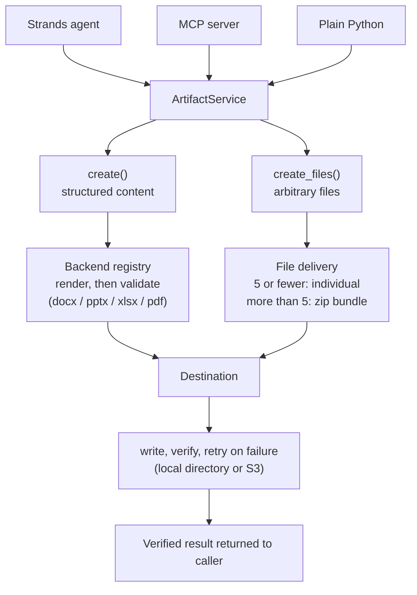

# Architecture

## The two delivery paths



Every consumer, regardless of framework, calls in with a declarative
spec rather than writing format-specific rendering code. `ArtifactService`
routes to one of two methods depending on what kind of content it is:

- [`create()`][artifactkit.ArtifactService.create] for content that needs
  rendering — a backend turns the spec into a real docx/pptx/xlsx/pdf
  file, then validates the result structurally before it's ever written
  anywhere.
- [`create_files()`][artifactkit.ArtifactService.create_files] for content
  that's already fully formed — code, images, data files. There's no
  format-specific structure to validate, so this path skips straight
  to write + verify. Above a file-count threshold, everything gets
  bundled into one zip instead of one write per file.

Both paths converge on the same destination layer, so write
verification and retry behavior are identical regardless of which path
got you there.

## Why two spec families instead of one

`DocumentSpec` / `PresentationSpec` / `WorkbookSpec` share a common
shape (title + ordered content + optional `base_filename`) because
documents, decks, and workbooks really are similar enough to benefit
from one mental model. `RawFile` / `FileBundleSpec` are deliberately
*not* forced into that same shape — a raw file has no "blocks" to
render, it's already bytes with a name. Trying to unify these into one
universal spec would mean forcing every consumer to populate irrelevant
fields on content that doesn't need them.

## Why render/validate/write/verify are four separate stages

Each stage fails for a different reason, and conflating them would mean
retrying things that can never succeed on retry:

| Stage | What it catches | Retried? |
|---|---|---|
| Render | A malformed spec | Never — same input, same failure, every time |
| Validate | A backend produced a structurally broken file | Never — same reason |
| Write | Network blips, throttling, transient destination errors | Yes, per the destination's `is_retryable()` |
| Verify | The write silently corrupted or truncated | The *verify failure itself* is not retried by default — it usually means real corruption, not transience |

`ArtifactValidationError` and `ArtifactWriteError` are distinct exception
types precisely so a calling agent can tell "fix your spec" apart from
"retry the write" without parsing an error message.

## Destinations are a protocol, not a fixed list

```python
class OutputDestination(Protocol):
    def write(self, local_path: Path, filename: str) -> WriteResult: ...
    def verify(self, write_result: WriteResult, local_path: Path) -> bool: ...
    def is_retryable(self, exc: Exception) -> bool: ...
    def presign(self, key: str) -> tuple[str, datetime] | None: ...
```

`LocalDirectoryDestination` and `S3Destination` ship built in. Adding
GCS or Azure Blob support means implementing this protocol once — no
changes to `ArtifactService`, no changes to any backend. `is_retryable`
lives on the destination itself because "is this error transient"
means something different per backend: an S3 `SlowDown` response is
retryable, a `NoSuchBucket` never will be, and a local disk error space
is entirely different again.

See the [API reference](api-reference.md) for the full method
signatures, and [Observability](observability.md) for what gets logged
and measured at each stage.
